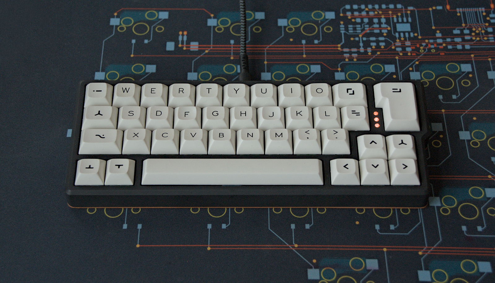
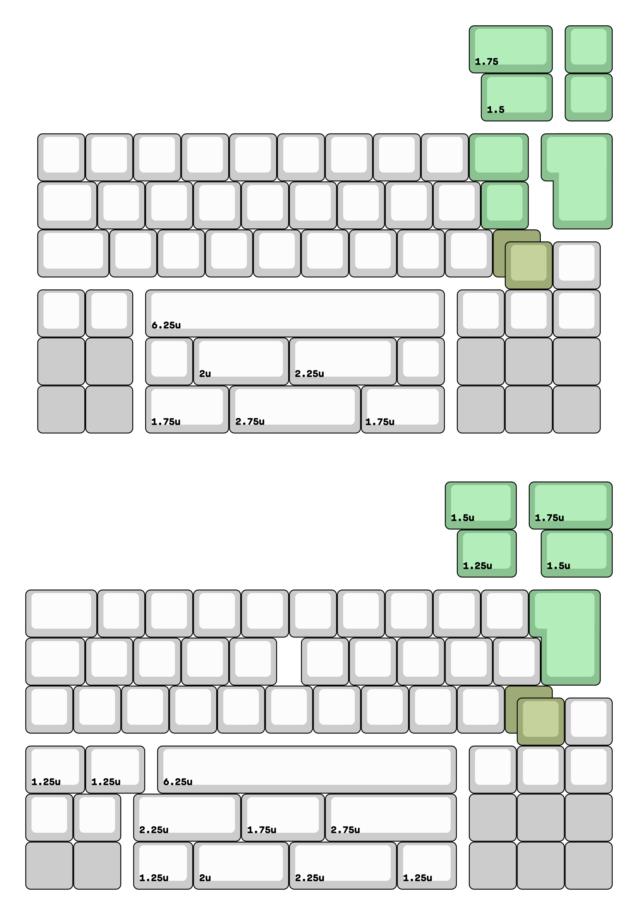
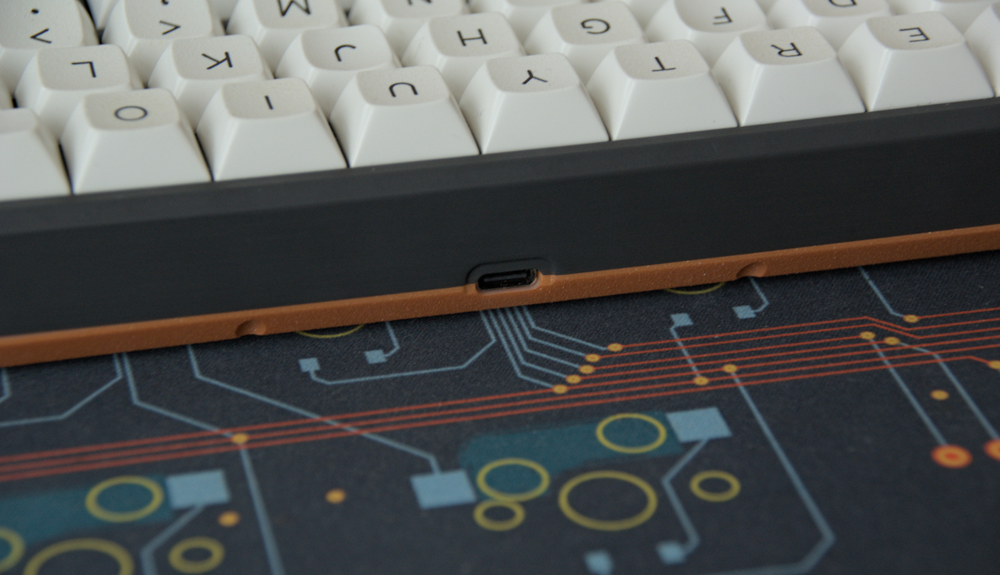
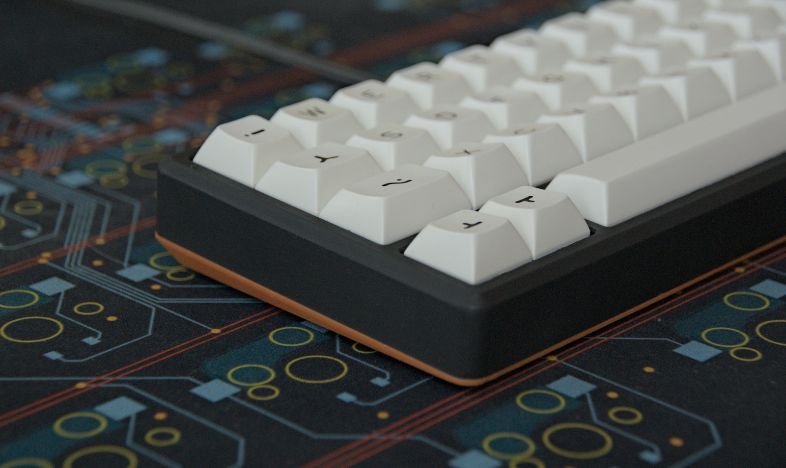
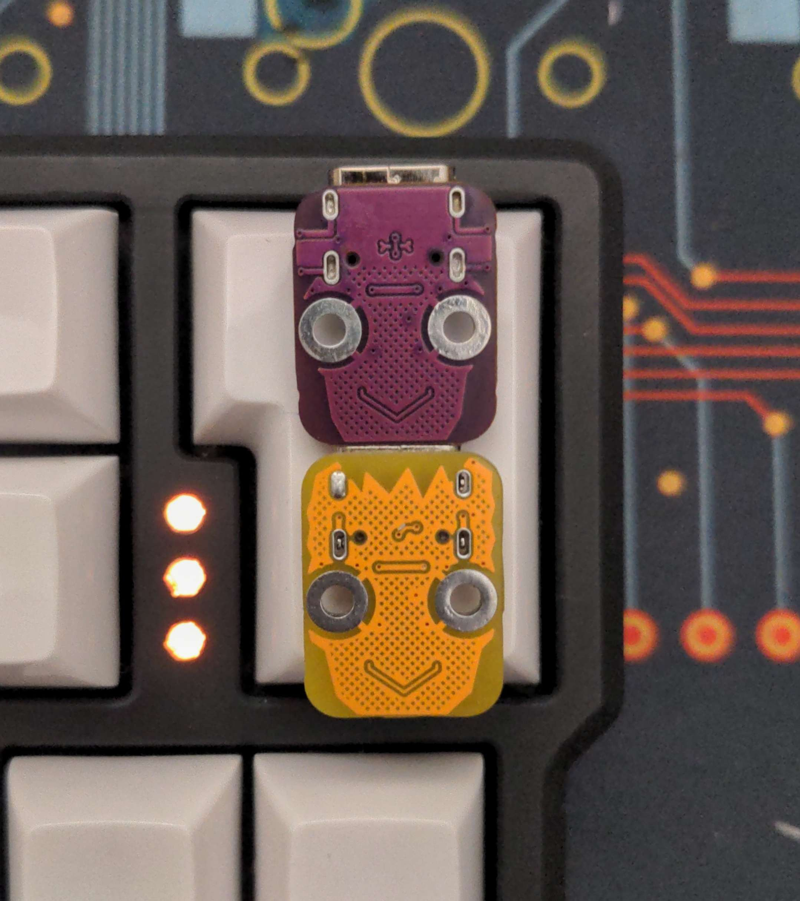

### Qazikat

qaz or katana stagger keyboard with offset spacebar, nav cluster and ISO enter

## Features

- flipable pcb, one side supports qaz rowstagger, the other katana stagger
- Hotswap sockets
- onboard rp2040
- indicator leds and underglow 
- production files for pcba
- case file for qaz variant are supplied (stl, dxf, as well as the freecad files)
- QMK with vial support
- completely open source, permissive license ([CERN-OHL-P](https://cern-ohl.web.cern.ch/home))

## Layouts

The pcb support both layouts - not at the same time, you have to choose when soldering hot swap sockets - just flip it around.

## Want one?

All production files you need to build your own board can be found [here](./prod/qazikat). You will also need the usb adapter found [here](./prod/usb)

## Parts

Parts needed for the assembled pcbs:

- 38-41 hotswap sockets
- your favourite switches
- usb adapter board
- 10 pin Type A (contacts on same side) FCC Cable, length about 15cm/6in
- optional: 3 or 21 SK6812MINI E RGB LEDs
- optional: 3 light guides, 2.8mm diameter
- optional: two 3x6mm micro push switches
- optional: for katana a 10pin 0.5mm pitch FCC Connector 

Parts needed for the case:

- 8 M2 heat inserts 

- 8 M2 screws, 8mm length

- 2 M2 screws, 4mm length

- 2 M2 nuts

## Build

- insert heat inserts into the provided holes in the top case. If you used PLA or Nylon, you can just meld them right in. If you have a resin case, check if you the inserts fit, they should go in with just a small amount of force. If that's not the case, try to use a file to widen the hole slightly.

- place the M2 nuts in the hexagonal shaped holes on the bottom and use the 4mm screws to hold the usb adapter board in place

- solder sockets and optionally LEDs (leds are mounted from the backside facing  "through" the pcb).

- If you want to use the underglow pcbs, use some solder to connect both 

- connect fcc cable to usb adaptor and qazikat pcb

## Firmware

firmware configs for qmk(only roughly tested) and vial can be found in [firmware folder](./firmware). Top LED support is still rudimentary and is done in qazikat.c . You can also comment out the functions in that file and also just let the backlight handle those.

The first time the pcb is plugged in, the bootloader will provide a drive to upload the firmware file.

The provided firmware enables to enter bootloader with double tap on the reset button. This can easily be done by shortening the pads with a paperclip or something similar. If this isn't working, try holding down the boot button and while pressed, tip reset.

You may either build the firmware yourself or use the provided vial firmware files [here](./firmware/uf2). You can use VIAL ([download](https://get.vial.today/) to program your board after that, without need to build a new firmware.

## The rest

Everything in this repository is free to use however you might see fit. If you want to support me and my projects, please consider linking back to this repository if you build/change/use anything.

If you would like to send me a tip, you could do it [here](https://ko-fi.com/weteor) (Please don't feel like you have to).

## More pictures

